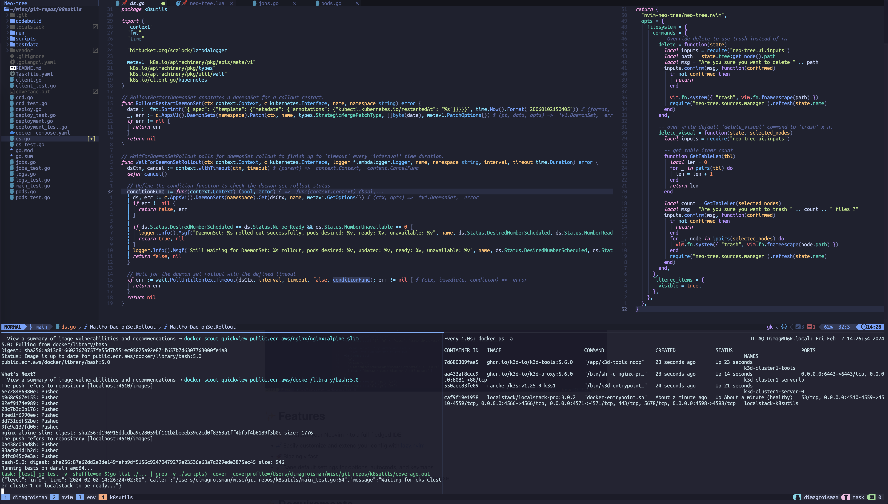

# Setup macOS

This Neovim setup is powered by [lazyvim] and [tmux].



```sh
brew install --cask font-ubuntu-mono-nerd-font
brew install --cask font-jetbrains-mono-nerd-font
brew install git neovim lazygit node trash ripgrep fd gnu-sed gmp tmux go fzf delve
npm install -g @anthropic-ai/claude-code
mv ~/.config/nvim{,.bak}
rm -rf ~/.local/share/nvim
rm -rf ~/.local/state/nvim
rm -rf ~/.cache/nvim
git clone https://github.com/dimaunx/lazyvim ~/.config/nvim
```

<!--links-->

[lazyvim]: https://www.lazyvim.org

[tmux]: https://github.com/tmux/tmux/wiki
